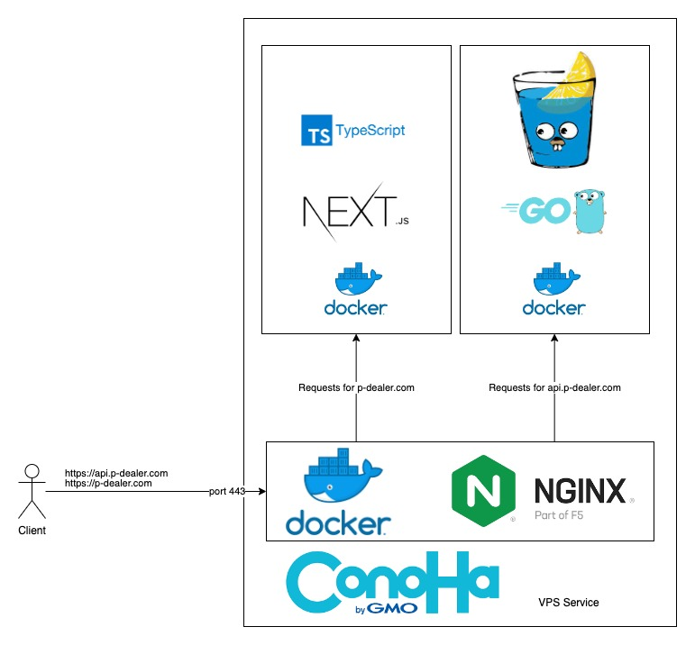

# P-Dealer

## 製品概要
ポーカーのチップ管理を行うアプリケーション
 
### 背景(製品開発のきっかけ、課題等）
共同開発をしている友人との共通の趣味がポーカーです。 ポーカーを行う中で共通の悩みとして、チップの計算や受け渡しなどに時間がかかることが挙げられます。 そこでポーカーの点数計算アプリを作成しようと考えました。
 
### 製品説明（具体的な製品の説明）
ボタン操作やポイント入力を行うだけで、ポーカーのゲーム進行をスムーズにすることができるアプリケーションです。 このアプリケーションは参加者一人一人が自分の携帯でゲーム内のアクションを選択し、ゲームの終了や参加者の持ちポイントの設定などゲームに参加するすべての人を管理することができます。  つまり、各々がこのアプリケーションをダウンロードし、使用するだけでポーカーというゲームを簡単に楽しむことができます。

### 特長
#### 1. 高級感のあるUIを作成
ギャンブルとしてのポーカーのイメージに合うような色で高級感を意識した黒と金がベースのUIを作成しました。

#### 2. 全文英語で作成
日本ではあまり馴染みのないポーカーですが、世界のプレイヤー人口は1億人を超えると言われています。 そのため、海外の方々に使っていただけるように全文英語での作成しました。

#### 3. 直感的に理解できるボタン操作・点数入力
ポーカーのルールは複雑であるが、初心者の方でもわかりやすく使いやすいボタン操作や点数入力を促すUIを作成しました。
 

### 解決出来ること
#### ゲーム時間の短縮
計算をアプリケーションに任せることができるため時間の短縮を出来ます。

#### コロナウイルスなどの感染対策
コロナウイルスなどの感染対策

### 今後の展望
今後は麻雀の点数計算機能の追加、住む場所によっての言語変更、ユーザー登録によるデータ管理の３つの機能を追加しようと考えています。 麻雀は点数計算が難しいゲームとしても知られています。 ですので、点数計算を自動で行うことができるアプリケーションは需要も高いため機能追加をしようと考えています。 ポーカーは世界中で好まれているゲームであるため言語圏の違いが生まれます。 この問題を解決するために、場所によっての言語変更を行えうことでユーザー人口の母数を格段に増やすことができると考えています。 ポーカーはゲームの特性上、駆け引きや相手の癖を見抜くことなどが重要視されています。 データの管理ができるようになることで、高次元での駆け引きを可能にすることができます。 高いレベルのゲームを望む方々にとっては、重要視される機能であると考えています。
 

### 注力したこと（こだわり等）
他の人のアクションによってリアルタイムでUIが変更されるようにしたことです。各々の携帯で操作を行うため、リアルタイムでのゲーム内容の反映が求められます。 そのため、全員が同じjsonの値受け取ることで現状をリアルタイム更新していき、WebSocketで受信しているバックエンドサーバーからのレスポンスに応じてUIの表示内容を切り替え、リアルタイムに適切なアクションが取れるようにしました。

## 開発技術
### 活用した技術
#### フレームワーク・ライブラリ・モジュール
- Frontend: TypeScript, Next.js, Tailwind, Jest
  - Author: [長谷川祥士](https://github.com/Hasegawa-Akito)
  - Document: [README](https://github.com/tokyo-azisai-paradise/poker-mahjong-calculation/blob/develop/frontend/README.md)
- Backend:  Go, Gin, Gorilla WebSocket
  - Author: [藤田恭輔](https://github.com/Techondorius)
  - Document: [README](https://github.com/tokyo-azisai-paradise/poker-mahjong-calculation/blob/develop/backend/readme.md)
- All slides authored by [田野壮一郎](https://github.com/soichi12188)
- Other:    Nginx, ConoHa VPS

